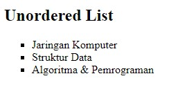
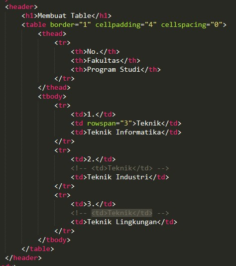
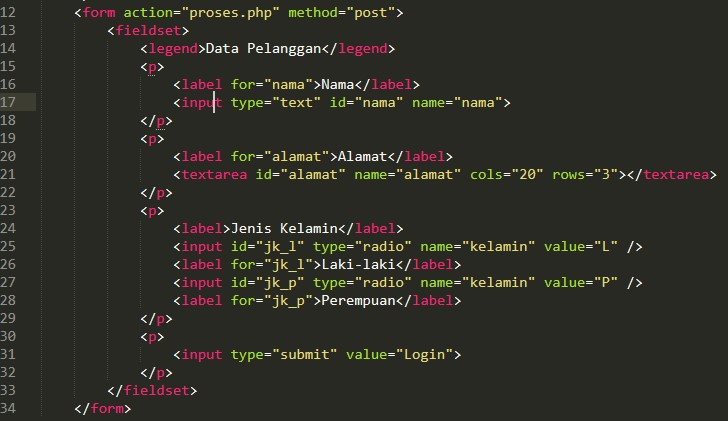

# Langkah-langkah pratikum
### Menyiapkan html

### Membuat ordered list

### Buka filenya dan lihat hasilnya

### Membuat unordered list

### Refresh dan lihat hasilnya

### Membuat description list

### Refresh dan lihat hasilnya

### Melakukan eksperimen

### Refresh dan lihat hasilnya

### Membuat tabel

### Refresh dan lihat hasilnya

### Menggabungkan sel data

### Output refresh dan lihat hasilnya

### Membuat form

### Output refresh dan lihat hasilnya

### Menambahkan style pada form

### Output refresh dan lihat hasilnya

### Validasi dokumen yang error di file lab3_Table.html

## Pertanyaan dan Tugas 
#### 1. Buatlah form yang menampilkan dropdown menu dan listbox dengan multiple selection. 

### Membuat form yang ada dropdown menu dan listbox
### Input

### Output

Sekian Terimakasih ^_^
